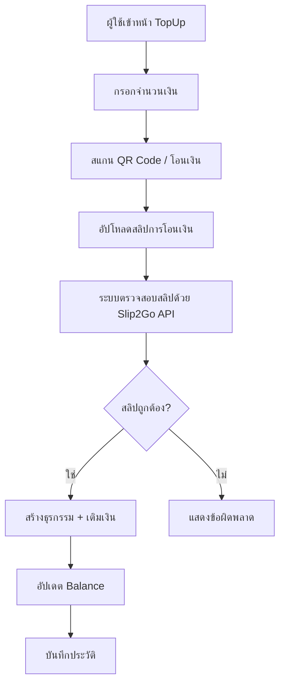
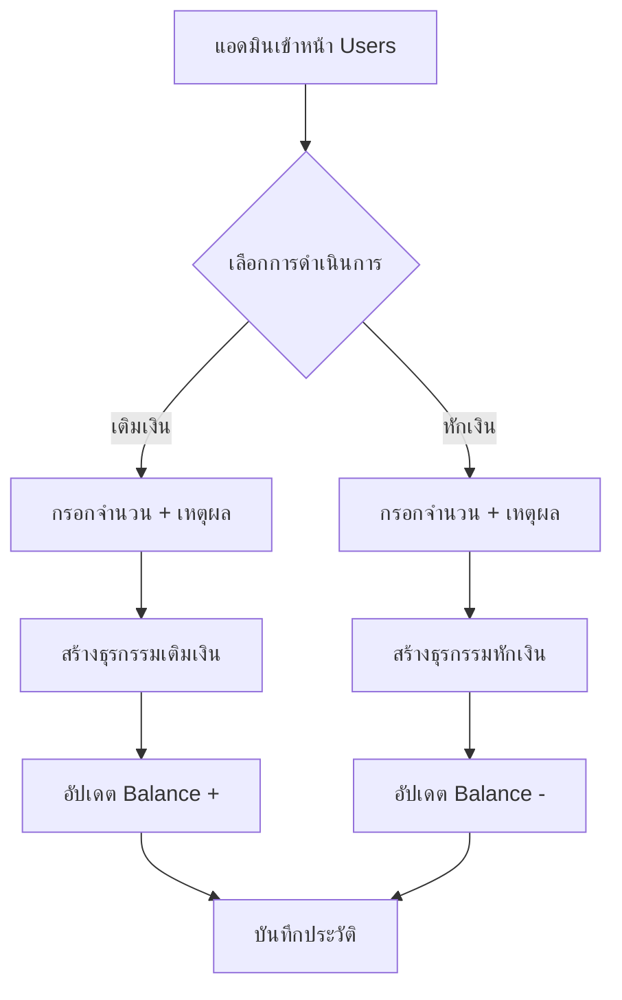

# 📋 ระบบตรวจสอบสลิปและการเติมเงิน (Slip Verification System)

## 📖 สารบัญ
1. [ภาพรวมระบบ](#ภาพรวมระบบ)
2. [โครงสร้างไฟล์](#โครงสร้างไฟล์)
3. [การทำงานของระบบ](#การทำงานของระบบ)
4. [API และ Utils](#api-และ-utils)
5. [Components](#components)
6. [Pages](#pages)
7. [Database Schema](#database-schema)
8. [โค้ดตัวอย่าง](#โค้ดตัวอย่าง)

---

## ภาพรวมระบบ

ระบบตรวจสอบสลิปและการเติมเงินประกอบด้วย:
- 🔍 **การตรวจสอบสลิปอัตโนมัติ** ด้วย Slip2Go API
- 💰 **การเติมเงินผ่าน PromptPay**
- 📊 **การจัดการธุรกรรม** (สร้าง, อัปเดต, ตรวจสอบสถานะ)
- 👥 **การจัดการเงินผู้ใช้** (เติมเงิน, หักเงิน โดยแอดมิน)
- 📜 **ประวัติการทำรายการ** แบบครบถ้วน

---

## โครงสร้างไฟล์

```
src/
├── lib/
│   ├── slip2goUtils.ts          # ⭐ Slip2Go API Integration
│   ├── topupUtils.ts            # 💰 Top-up Transaction Management
│   └── paymentHelpers.ts        # 💳 Payment Helper Functions
├── pages/
│   ├── TopUp.tsx                # 📤 หน้าเติมเงิน
│   ├── TopUpHistory.tsx         # 📜 ประวัติการเติมเงิน
│   ├── SlipHistory.tsx          # 🔍 ค้นหาสลิป
│   └── Users.tsx                # 👥 จัดการผู้ใช้ (แอดมิน)
└── components/
    └── GeneratePromptPayQR.tsx  # 🔲 สร้าง QR Code

firebase/
└── collections/
    └── topUpTransactions/       # 💾 ธุรกรรมการเติมเงิน
```

---

## การทำงานของระบบ

### 1️⃣ **ผู้ใช้เติมเงิน (User Top-up Flow)**



### 2️⃣ **แอดมินจัดการเงิน (Admin Management Flow)**



---

## API และ Utils

### 📄 **slip2goUtils.ts** - Slip2Go API Integration

```typescript
// ฟังก์ชันหลักในการตรวจสอบสลิป

/**
 * ตรวจสอบสลิปจากรูปภาพ
 * @param imageFile - ไฟล์รูปภาพสลิป
 * @param checkCondition - เงื่อนไขการตรวจสอบ (จำนวนเงิน, บัญชีปลายทาง)
 * @returns ผลการตรวจสอบพร้อมข้อมูลสลิป
 */
async verifySlipByImage(
  imageFile: File, 
  checkCondition?: CheckCondition
): Promise<SlipVerificationResult>

/**
 * ตรวจสอบสลิปจาก QR Code
 * @param qrCode - ข้อความ QR Code
 * @param checkCondition - เงื่อนไขการตรวจสอบ
 */
async verifySlipByQRCode(
  qrCode: string, 
  checkCondition?: CheckCondition
): Promise<SlipVerificationResult>

/**
 * สร้าง QR Code สำหรับ PromptPay
 * @param phoneNumber - เบอร์โทรศัพท์
 * @param amount - จำนวนเงิน
 */
async generatePromptPayQRCode(
  phoneNumber: string, 
  amount: number
): Promise<string>

/**
 * ค้นหาข้อมูลสลิปด้วย Reference ID
 * @param referenceId - รหัสอ้างอิง
 */
async getSlipByReferenceId(
  referenceId: string
): Promise<SlipData>
```

### 📄 **topupUtils.ts** - Transaction Management

```typescript
/**
 * สร้างธุรกรรมการเติมเงิน
 * @param userId - User ID
 * @param amount - จำนวนเงิน (ใช้ค่าลบสำหรับหักเงิน)
 * @param paymentMethod - วิธีการชำระเงิน
 * @param verificationMethod - วิธีตรวจสอบ
 * @param slipData - ข้อมูลสลิป
 */
async createTopUpTransaction(
  userId: string,
  amount: number,
  paymentMethod: 'promptpay' | 'bank_transfer' | 'admin',
  verificationMethod: 'qr' | 'image' | 'manual',
  slipData?: any
): Promise<string>

/**
 * อัปเดตธุรกรรมให้สำเร็จและเติมเงินเข้าบัญชี
 * @param transactionId - Transaction ID
 * @param userId - User ID
 * @param amount - จำนวนเงิน
 */
async completeTopUpTransaction(
  transactionId: string,
  userId: string,
  amount: number
): Promise<void>

/**
 * ดึงประวัติการเติมเงินของผู้ใช้
 * @param userId - User ID
 */
async getUserTopUpHistory(
  userId: string
): Promise<TopUpTransaction[]>

/**
 * ดึงสถิติการเติมเงินของผู้ใช้
 * @param userId - User ID
 */
async getUserTopUpStats(userId: string): Promise<{
  totalAmount: number;
  successfulTransactions: number;
  pendingTransactions: number;
  failedTransactions: number;
}>
```

### 📄 **paymentHelpers.ts** - Payment Helpers

```typescript
/**
 * สร้างลิงก์รูป QR Code สำหรับ PromptPay
 * @param phoneNumber - เบอร์โทรศัพท์
 * @param amount - จำนวนเงิน
 */
export function generatePromptPayQRImageLink(
  phoneNumber: string,
  amount: number
): string

/**
 * คำนวณยอดรวมพร้อม fee
 * @param amount - จำนวนเงิน
 * @param feePercentage - เปอร์เซ็นต์ค่าธรรมเนียม
 */
export function calculateTotalWithFee(
  amount: number,
  feePercentage: number = 0
): number
```

---

## Components

### 🔲 **GeneratePromptPayQR.tsx**

Component สำหรับสร้างและแสดง QR Code PromptPay

```typescript
interface GeneratePromptPayQRProps {
  phoneNumber: string;
  amount: number;
  onGenerated?: (qrCodeUrl: string) => void;
}

export default function GeneratePromptPayQR({
  phoneNumber,
  amount,
  onGenerated
}: GeneratePromptPayQRProps)
```

**การใช้งาน:**
```tsx
<GeneratePromptPayQR
  phoneNumber="0812345678"
  amount={500}
  onGenerated={(url) => console.log('QR Generated:', url)}
/>
```

---

## Pages

### 📤 **TopUp.tsx** - หน้าเติมเงิน

**ฟีเจอร์:**
- ✅ กรอกจำนวนเงิน
- ✅ แสดง QR Code PromptPay
- ✅ อัปโหลดสลิปการโอนเงิน
- ✅ ตรวจสอบสลิปอัตโนมัติ
- ✅ เติมเงินเข้าบัญชีทันที

**โค้ดหลัก:**
```typescript
const handleVerifySlip = async () => {
  if (!slipImage) return;

  setVerifying(true);
  try {
    // สร้าง check condition
    const checkCondition = {
      amount: amount,
      transRef: expectedTransRef
    };

    // ตรวจสอบสลิป
    const result = await verifySlipByImage(slipImage, checkCondition);

    if (result.success && result.data) {
      // สร้างธุรกรรม
      const transactionId = await createTopUpTransaction(
        user.uid,
        amount,
        'promptpay',
        'image',
        {
          referenceId: result.data.referenceId,
          senderName: result.data.sender.account.name,
          receiverAccount: result.data.receiver.account.bank.account,
          amount: result.data.amount
        }
      );

      // เติมเงิน
      await completeTopUpTransaction(transactionId, user.uid, amount);
      
      toast.success('เติมเงินสำเร็จ!');
    }
  } catch (error) {
    toast.error('เกิดข้อผิดพลาด');
  } finally {
    setVerifying(false);
  }
};
```

### 📜 **TopUpHistory.tsx** - ประวัติการเติมเงิน

**ฟีเจอร์:**
- ✅ แสดงรายการเติมเงินทั้งหมด
- ✅ แสดงสถานะ (สำเร็จ, รอดำเนินการ, ล้มเหลว)
- ✅ แสดงสถิติการเติมเงิน
- ✅ กรองและค้นหารายการ

**โค้ดหลัก:**
```typescript
const loadHistory = async () => {
  if (!user) return;

  const [historyData, statsData] = await Promise.all([
    getUserTopUpHistory(user.uid),
    getUserTopUpStats(user.uid)
  ]);

  setTransactions(historyData);
  setStats(statsData);
};

const getStatusBadge = (status: string) => {
  switch (status) {
    case 'completed':
      return <Badge className="bg-green-500">สำเร็จ</Badge>;
    case 'pending':
      return <Badge className="bg-yellow-500">รอดำเนินการ</Badge>;
    case 'failed':
      return <Badge variant="destructive">ล้มเหลว</Badge>;
  }
};
```

### 🔍 **SlipHistory.tsx** - ค้นหาสลิป

**ฟีเจอร์:**
- ✅ ค้นหาสลิปด้วย Reference ID
- ✅ แสดงรายละเอียดสลิปครบถ้วน
- ✅ บันทึกประวัติการค้นหา
- ✅ คัดลอกข้อมูลสลิป

**โค้ดหลัก:**
```typescript
const handleSearchByReferenceId = async () => {
  setIsLoading(true);
  try {
    const slipData = await getSlipByReferenceId(referenceId);
    
    // เพิ่มในประวัติ
    const newHistory = [slipData, ...slipHistory];
    setSlipHistory(newHistory);
    setSelectedSlip(slipData);
    
    toast.success('พบข้อมูลสลิป!');
  } catch (error) {
    toast.error('ไม่พบข้อมูลสลิป');
  } finally {
    setIsLoading(false);
  }
};
```

### 👥 **Users.tsx** - จัดการผู้ใช้ (แอดมิน)

**ฟีเจอร์:**
- ✅ เติมเงินให้ผู้ใช้
- ✅ **หักเงินจากผู้ใช้** (ใหม่!)
- ✅ ดูประวัติการเติมเงิน
- ✅ แก้ไขข้อมูลผู้ใช้

**โค้ดเติมเงิน:**
```typescript
const handleTopUpUser = async () => {
  const transactionId = await createTopUpTransaction(
    userToTopUp.uid,
    topUpAmount,
    'admin',
    'manual',
    {
      adminTopUp: true,
      reason: topUpReason || 'เติมเงินโดยแอดมิน',
      adminId: 'admin'
    }
  );

  await completeTopUpTransaction(transactionId, userToTopUp.uid, topUpAmount);
  toast.success('เติมเงินสำเร็จ');
};
```

**โค้ดหักเงิน:**
```typescript
const handleDeductUser = async () => {
  // ตรวจสอบยอดเงิน
  if ((userToDeduct.balance || 0) < deductAmount) {
    toast.error('ยอดเงินไม่เพียงพอ');
    return;
  }

  // สร้างธุรกรรมหักเงิน (ใช้จำนวนติดลบ)
  const transactionId = await createTopUpTransaction(
    userToDeduct.uid,
    -deductAmount, // ⚠️ ค่าติดลบ
    'admin',
    'manual',
    {
      adminDeduct: true,
      reason: deductReason || 'หักเงินโดยแอดมิน',
      adminId: 'admin'
    }
  );

  await completeTopUpTransaction(transactionId, userToDeduct.uid, -deductAmount);
  toast.success('หักเงินสำเร็จ');
};
```

---

## Database Schema

### 📊 **Collection: `topUpTransactions`**

```typescript
interface TopUpTransaction {
  id: string;
  userId: string;                    // User ID
  amount: number;                     // จำนวนเงิน (+ = เติม, - = หัก)
  status: 'pending' | 'completed' | 'failed';
  paymentMethod: 'promptpay' | 'bank_transfer' | 'admin';
  verificationMethod: 'qr' | 'image' | 'manual';
  createdAt: Timestamp;
  completedAt?: Timestamp;
  failedAt?: Timestamp;
  failedReason?: string;
  slipData?: {
    referenceId: string;             // Reference ID จากสลิป
    senderName: string;              // ชื่อผู้ส่ง
    senderAccount?: string;          // เลขบัญชีผู้ส่ง
    receiverAccount: string;         // เลขบัญชีผู้รับ
    amount: number;                  // จำนวนเงินในสลิป
    transRef: string;                // Transaction Reference
    ref1?: string;
    ref2?: string;
    ref3?: string;
    reason?: string;                 // เหตุผล (สำหรับแอดมิน)
    adminTopUp?: boolean;            // เติมเงินโดยแอดมิน
    adminDeduct?: boolean;           // หักเงินโดยแอดมิน
    adminId?: string;                // แอดมินที่ดำเนินการ
  };
}
```

### 📊 **Collection: `users`**

```typescript
interface UserData {
  uid: string;
  email: string;
  balance: number;                   // ยอดเงินในระบบ
  role: 'user' | 'admin';
  verified: boolean;
  emailVerified: boolean;
  createdAt: Timestamp;
  // ... ฟิลด์อื่นๆ
}
```

---

## โค้ดตัวอย่าง

### 1️⃣ **การตรวจสอบสลิปและเติมเงิน (Complete Flow)**

```typescript
import { verifySlipByImage } from '@/lib/slip2goUtils';
import { createTopUpTransaction, completeTopUpTransaction } from '@/lib/topupUtils';

async function handleTopUpWithSlip(
  userId: string,
  amount: number,
  slipImage: File
) {
  try {
    // 1. ตรวจสอบสลิป
    const checkCondition = {
      amount: amount,
      transRef: `TXN${Date.now()}`
    };

    const verification = await verifySlipByImage(slipImage, checkCondition);

    if (!verification.success) {
      throw new Error('สลิปไม่ถูกต้อง');
    }

    // 2. สร้างธุรกรรม
    const transactionId = await createTopUpTransaction(
      userId,
      amount,
      'promptpay',
      'image',
      {
        referenceId: verification.data.referenceId,
        senderName: verification.data.sender.account.name,
        receiverAccount: verification.data.receiver.account.bank.account,
        amount: verification.data.amount,
        transRef: verification.data.transRef
      }
    );

    // 3. เติมเงินและอัปเดตสถานะ
    await completeTopUpTransaction(transactionId, userId, amount);

    return { success: true, transactionId };
  } catch (error) {
    console.error('Error:', error);
    return { success: false, error };
  }
}
```

### 2️⃣ **การเติมเงินโดยแอดมิน**

```typescript
async function adminTopUp(
  adminId: string,
  userId: string,
  amount: number,
  reason: string
) {
  const transactionId = await createTopUpTransaction(
    userId,
    amount,
    'admin',
    'manual',
    {
      adminTopUp: true,
      reason: reason,
      adminId: adminId
    }
  );

  await completeTopUpTransaction(transactionId, userId, amount);
  
  return transactionId;
}
```

### 3️⃣ **การหักเงินโดยแอดมิน**

```typescript
async function adminDeduct(
  adminId: string,
  userId: string,
  amount: number,
  reason: string
) {
  // ตรวจสอบยอดเงิน
  const userDoc = await getDoc(doc(db, 'users', userId));
  const currentBalance = userDoc.data()?.balance || 0;

  if (currentBalance < amount) {
    throw new Error('ยอดเงินไม่เพียงพอ');
  }

  // สร้างธุรกรรมหักเงิน (ใช้จำนวนติดลบ)
  const transactionId = await createTopUpTransaction(
    userId,
    -amount, // ⚠️ ติดลบ
    'admin',
    'manual',
    {
      adminDeduct: true,
      reason: reason,
      adminId: adminId
    }
  );

  await completeTopUpTransaction(transactionId, userId, -amount);
  
  return transactionId;
}
```

### 4️⃣ **สร้าง QR Code PromptPay**

```typescript
import { generatePromptPayQRCode } from '@/lib/slip2goUtils';

async function createPromptPayQR(phoneNumber: string, amount: number) {
  try {
    const qrCodeDataUrl = await generatePromptPayQRCode(phoneNumber, amount);
    
    // qrCodeDataUrl เป็น data:image/png;base64,...
    return qrCodeDataUrl;
  } catch (error) {
    console.error('Error generating QR:', error);
    throw error;
  }
}

// การใช้งาน
const qrCode = await createPromptPayQR('0812345678', 500);
// แสดงใน 
```

### 5️⃣ **ค้นหาสลิปด้วย Reference ID**

```typescript
import { getSlipByReferenceId } from '@/lib/slip2goUtils';

async function searchSlip(referenceId: string) {
  try {
    const slipData = await getSlipByReferenceId(referenceId);
    
    console.log('Sender:', slipData.sender.account.name);
    console.log('Amount:', slipData.amount);
    console.log('Date:', slipData.dateTime);
    
    return slipData;
  } catch (error) {
    console.error('Slip not found:', error);
    throw error;
  }
}
```

### 6️⃣ **ดึงประวัติและสถิติการเติมเงิน**

```typescript
import { getUserTopUpHistory, getUserTopUpStats } from '@/lib/topupUtils';

async function loadUserTopUpData(userId: string) {
  const [history, stats] = await Promise.all([
    getUserTopUpHistory(userId),
    getUserTopUpStats(userId)
  ]);

  console.log('Total amount:', stats.totalAmount);
  console.log('Successful:', stats.successfulTransactions);
  console.log('Pending:', stats.pendingTransactions);
  console.log('Failed:', stats.failedTransactions);
  console.log('Transactions:', history);

  return { history, stats };
}
```

---

## 🔐 Security Best Practices

### 1. **API Keys**
```typescript
// ใช้ environment variables
const SLIP2GO_API_KEY = import.meta.env.VITE_SLIP2GO_API_KEY;

// อย่า commit API keys ใน code
// ใช้ .env.local และเพิ่มใน .gitignore
```

### 2. **Transaction Validation**
```typescript
// ตรวจสอบจำนวนเงินก่อนดำเนินการ
if (amount <= 0) {
  throw new Error('Invalid amount');
}

// ตรวจสอบ balance ก่อนหักเงิน
if (userBalance < deductAmount) {
  throw new Error('Insufficient balance');
}
```

### 3. **Error Handling**
```typescript
try {
  await verifySlipByImage(image, condition);
} catch (error) {
  if (error instanceof Error) {
    console.error('Error:', error.message);
    toast.error(error.message);
  } else {
    console.error('Unknown error:', error);
    toast.error('เกิดข้อผิดพลาด');
  }
}
```

---

## 📝 Notes

### การหักเงิน vs การเติมเงิน
- **เติมเงิน**: `amount > 0`
- **หักเงิน**: `amount < 0`
- ระบบใช้ค่า `amount` เดียวกันในการจัดการทั้งสองกรณี

### สถานะธุรกรรม
- `pending`: รอดำเนินการ (ยังไม่เติมเงิน)
- `completed`: สำเร็จ (เติมเงินแล้ว)
- `failed`: ล้มเหลว (ยกเลิกหรือเกิดข้อผิดพลาด)

### ประวัติการทำรายการ
- บันทึกทุกธุรกรรมใน `topUpTransactions`
- แยกประวัติตาม `userId`
- สามารถค้นหาด้วย `referenceId` ได้

---

## 🚀 การพัฒนาต่อ

### หน้าที่ควรเพิ่ม
1. **SlipVerification.tsx** - หน้าสำหรับแอดมินอนุมัติสลิปที่รอดำเนินการ
2. **AdminTopUpRequests.tsx** - จัดการคำขอเติมเงินทั้งหมด
3. **TransactionReport.tsx** - รายงานการเงินแบบละเอียด

### ฟีเจอร์ที่ควรเพิ่ม
- [ ] ระบบแจ้งเตือนเมื่อมีคำขอเติมเงินใหม่
- [ ] การอนุมัติ/ปฏิเสธสลิปโดยแอดมิน
- [ ] Export ประวัติการทำรายการเป็น Excel/PDF
- [ ] Dashboard แสดงสถิติการเงิน
- [ ] Webhook สำหรับตรวจสอบสลิปอัตโนมัติ

---

## 📞 Support

หากมีปัญหาหรือข้อสงสัย:
- 📧 Email: support@baimonshop.com
- 📱 Line: @baimonshop
- 🌐 Website: https://baimonshop.com

---

**Last Updated:** December 7, 2025
**Version:** 1.0.0
